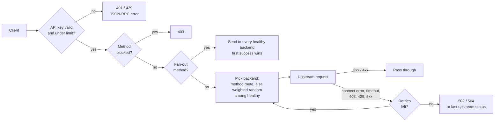

# sol-rpc-router

[](https://github.com/glamsystems/sol-rpc-router/actions/workflows/ci.yml)
[](LICENSE)

One URL in front of all your Solana RPC providers. Written in Rust, built for bots.

You have a Helius key, a Triton key, a QuickNode key and the public RPC. Your bots have one hard-coded URL. When a provider rate-limits you, lags behind the tip, or just dies, you want traffic to move somewhere else *before* you notice. You also want to hand a key to a friend without handing them your provider credentials or an unlimited bill.

`sol-rpc-router` is that layer:

- **Automatic failover.** Connection errors, timeouts, 429s and 5xxs are retried on a different healthy backend. Clients see one response.
- **`sendTransaction` fan-out.** Broadcast a transaction to every healthy backend at once and return the first success. More leaders see your tx sooner.
- **Consensus-aware health checks.** A backend that falls more than N slots behind the best one is pulled from rotation until it catches up.
- **Per-key auth and rate limits.** Keys live in Redis. Give each bot, friend or service its own key, RPS budget and expiry. Revoke in one command.
- **Method blocklist and routing.** Keep `getProgramAccounts` off the shared endpoint, or pin DAS calls to the one provider that supports them.
- **WebSockets too.** Subscriptions go through the same auth and backend selection.
- **Observability built in.** Prometheus metrics, a Grafana dashboard, a `/health` endpoint with per-backend slot and latency, and `x-rpc-backend` / `x-request-id` headers on every response.
- **Fast.** About 77k req/s in-process at p99 1.3 ms on a laptop. The router will not be your bottleneck.

## Quick start

### Docker Compose (router + Redis + Prometheus + Grafana)

```bash
git clone https://github.com/glamsystems/sol-rpc-router && cd sol-rpc-router
cp config.example.toml config.toml        # put your provider URLs in here
docker compose up -d --build
docker compose exec router rpc-admin create my-bot --rate-limit 100
```

Point your bot at `http://localhost:28899/?api-key=<the key it printed>`. Grafana is on <http://localhost:3000> (admin / admin) with the dashboard pre-provisioned.

### From source

```bash
cargo build --release
./target/release/sol-rpc-router --config config.toml      # needs Redis running
./target/release/rpc-admin create my-bot --rate-limit 100
```

Pre-built binaries and a multi-arch container image (`ghcr.io/glamsystems/sol-rpc-router`) are attached to each [release](https://github.com/glamsystems/sol-rpc-router/releases).

## Using it

Any Solana client works unchanged. Pass the key as a query parameter, a header, or a bearer token:

```bash
# query parameter (works with every SDK, just change the URL)
curl -X POST 'http://localhost:28899/?api-key=KEY' -H 'content-type: application/json' \
  -d '{"jsonrpc":"2.0","id":1,"method":"getSlot"}'

# header
curl -X POST http://localhost:28899/ -H 'x-api-key: KEY' -H 'content-type: application/json' \
  -d '{"jsonrpc":"2.0","id":1,"method":"getLatestBlockhash"}'

# bearer
curl -X POST http://localhost:28899/ -H 'authorization: Bearer KEY' ...
```

```ts
import { Connection } from "@solana/web3.js";

const connection = new Connection("http://localhost:28899/?api-key=KEY", {
  wsEndpoint: "ws://localhost:28900/?api-key=KEY",   // or ws://localhost:28899/?api-key=KEY
  commitment: "confirmed",
});
```

Every response carries:

| Header | Meaning |
|---|---|
| `x-rpc-backend` | Label of the backend that answered |
| `x-rpc-attempts` | How many backends were tried (normal) or how many had replied when the winner was picked (fan-out) |
| `x-request-id` | Generated per request, or echoed if you sent one. Also forwarded upstream. |

Router credentials (`?api-key=`, `x-api-key`, `authorization`) are stripped before the request is forwarded. Backend URLs may carry their own `?api-key=` for the provider; the router merges them correctly.

## How a request flows



### Failover rules

| Upstream outcome | Action |
|---|---|
| 2xx, or 4xx other than 408/429 | Returned to the client as-is |
| 408, 429, 5xx | Retried on another healthy backend; if retries run out, the last upstream response is returned untouched |
| Connection error or timeout | Retried on another healthy backend; if retries run out, a 502 / 504 JSON-RPC error is returned |

`proxy.max_retries` (default `2`) caps the extra backends tried. A backend is never tried twice for one request. Method routes are honoured on the first attempt only.

### Fan-out

For methods listed in `proxy.fanout_methods` (typically `["sendTransaction"]`), the request is sent to every healthy backend concurrently. The first response that is HTTP 2xx *and* has no JSON-RPC `error` member is returned. If nobody succeeds, the first upstream error body (e.g. `Blockhash not found`) is surfaced so you can act on it. The other sends are not cancelled when a winner is picked, so every backend still gets the transaction.

Fan-out multiplies your upstream request count by the number of healthy backends. It is opt-in.

### Health checks

Every `interval_secs`, all backends are probed concurrently with `health_check.method` (`getSlot` by default). A backend fails a probe when the request errors, times out, returns a non-2xx status, or, for `getSlot` / `getBlockHeight`, is more than `max_slot_lag` slots behind the best backend in the same round. `consecutive_failures_threshold` probes in a row remove it from rotation; `consecutive_successes_threshold` put it back. Backends start healthy, so a fresh router serves traffic immediately.

## Configuration

```toml
port = 28899             # JSON-RPC over HTTP + WebSocket upgrades. Dedicated WS listener on port+1.
metrics_port = 28901     # Prometheus. Keep it private.
redis_url = "redis://127.0.0.1:6379/0"   # or set REDIS_URL

[[backends]]
label = "helius"
url = "https://mainnet.helius-rpc.com/?api-key=YOUR_KEY"
ws_url = "wss://mainnet.helius-rpc.com/?api-key=YOUR_KEY"   # optional; needed for WebSocket traffic
weight = 10

[[backends]]
label = "public"
url = "https://api.mainnet-beta.solana.com"
weight = 1

[proxy]
timeout_secs = 30                      # per attempt
max_retries = 2                        # extra backends to try on failure
fanout_methods = ["sendTransaction"]
blocked_methods = ["getProgramAccounts"]
shutdown_grace_secs = 10               # drain time after SIGTERM

[health_check]
interval_secs = 30
timeout_secs = 5
method = "getSlot"
consecutive_failures_threshold = 3
consecutive_successes_threshold = 2
max_slot_lag = 50

[method_routes]                        # pin methods to a backend; falls back if it is unhealthy
getAsset = "helius"
searchAssets = "helius"
```

See [`config.example.toml`](config.example.toml) for the annotated version. Validation rejects empty or duplicate labels, zero weights, non-`http(s)` / `ws(s)` URLs, routes to unknown labels, port collisions, and methods that are both fanned out and blocked.

### Hot reload

Edit the file, then send `SIGHUP` (`./reload.sh` does this). Backends, weights, routes, fan-out and blocked lists, timeouts and health-check settings are swapped atomically; in-flight requests finish on the old state. Backends that keep their label keep their health history. The listen ports and Redis URL need a restart.

### Environment

| Variable | Effect |
|---|---|
| `RPC_ROUTER_CONFIG` | Config path (same as `--config`) |
| `REDIS_URL` | Overrides `redis_url` from the file |
| `RUST_LOG` | Log level, e.g. `info` or `sol_rpc_router=debug` |

## API keys

Keys are hashes in Redis (`api_key:<key>`) with `owner`, `rate_limit`, `active`, `created_at` and optional `expires_at`. The router caches lookups for 60 s, so revocations and limit changes take up to a minute to apply. Rate limits are per-second counters enforced atomically in Redis, so they hold across multiple router instances sharing one Redis.

```bash
rpc-admin create alice --rate-limit 50                 # 50 req/s, never expires
rpc-admin create trial --rate-limit 10 --expires-in 7d # relative expiry (s, m, h, d, w)
rpc-admin create ci --rate-limit 0 --key my-fixed-key  # 0 = unlimited; custom key value
rpc-admin list [--owner alice]
rpc-admin inspect <key>                                 # includes requests used this second
rpc-admin update <key> --rate-limit 100 --active false --expires-in 30d
rpc-admin revoke <key>                                  # keeps metadata, stops working
rpc-admin delete <key>                                  # gone
```

`--redis-url` or `REDIS_URL` selects the Redis instance.

## Endpoints

| Endpoint | Method | Auth | Description |
|---|---|---|---|
| `/` | POST | yes | JSON-RPC proxy (single or batch) |
| `/*path` | POST | yes | Same, with the sub-path appended to the backend URL |
| `/` | GET + `Upgrade: websocket` | yes | WebSocket proxy on the main port |
| `ws://host:port+1/` | WS | yes | Dedicated WebSocket listener |
| `/health` | GET | no | Backend status JSON; 200 if any backend is healthy, else 503 |
| `:metrics_port/metrics` | GET | no | Prometheus metrics |

Router-generated errors are JSON-RPC shaped and keep your request `id`:

```json
{"jsonrpc":"2.0","error":{"code":-32005,"message":"Rate limit exceeded"},"id":1}
```

| HTTP | code | When |
|---|---|---|
| 401 | -32001 | Missing, unknown, revoked or expired key |
| 429 | -32005 | Key over its per-second limit (`Retry-After: 1`) |
| 403 | -32601 | Method is in `blocked_methods` |
| 413 | -32600 | Body over 10 MB |
| 503 | -32010 | No healthy backend |
| 502 | -32011 | All attempts failed with transport errors |
| 504 | -32012 | All attempts timed out |

## Observability

`GET /health`:

```json
{
  "overall_status": "healthy",
  "version": "0.2.0",
  "healthy_backends": 2,
  "total_backends": 3,
  "backends": [
    { "label": "helius", "healthy": true, "slot": 454772124, "latency_ms": 43,
      "last_check_unix": 1791523681, "last_check_age_secs": 1,
      "consecutive_failures": 0, "consecutive_successes": 2, "last_error": null },
    { "label": "dead", "healthy": false, "slot": null, "latency_ms": 0,
      "last_check_unix": 1791523681, "last_check_age_secs": 1,
      "consecutive_failures": 2, "consecutive_successes": 0,
      "last_error": "Health check request failed: client error (Connect)" }
  ]
}
```

Prometheus metrics (the `rpc_method` label is restricted to known Solana methods plus `batch` and `other`, so clients cannot inflate cardinality):

| Metric | Type | Labels |
|---|---|---|
| `rpc_requests_total` | counter | `method`, `status`, `rpc_method`, `backend`, `owner` |
| `rpc_request_duration_seconds` | histogram | `rpc_method`, `backend`, `owner` |
| `rpc_upstream_attempts_total` | counter | `backend`, `outcome` (`ok`, `upstream_status`, `retryable_status`, `timeout`, `transport_error`) |
| `rpc_failovers_total` | counter | `rpc_method` |
| `rpc_fanout_total` | counter | `rpc_method`, `outcome` (`ok`, `failed`) |
| `rpc_blocked_total` | counter | `rpc_method`, `owner` |
| `rpc_backend_health` | gauge | `backend` (1 healthy, 0 not) |
| `rpc_backend_slot` | gauge | `backend` |
| `rpc_backend_slot_lag` | gauge | `backend` (slots behind the best backend) |
| `rpc_backend_health_check_duration_seconds` | histogram | `backend` |
| `ws_connections_total` | counter | `backend`, `owner`, `status` |
| `ws_active_connections` | gauge | `backend`, `owner` |
| `ws_messages_total` | counter | `backend`, `owner`, `direction` |
| `ws_connection_duration_seconds` | histogram | `backend`, `owner` |

The Grafana dashboard in [`grafana/dashboards`](grafana/dashboards) covers throughput, latency, per-backend health and slot lag, failovers, fan-out outcomes, error rates and per-owner usage. `docker compose up` provisions it automatically.

Request logs are one line per request with method, status, duration, backend, owner, attempt count and request id.

## Deployment notes

- The router speaks plain HTTP. Terminate TLS in front of it (Caddy, nginx, a cloud load balancer).
- Expose `port` (and `port+1` if you want the dedicated WS listener). Keep `metrics_port` and Redis private.
- Run as many router instances as you like against one Redis; rate limits stay consistent.
- `SIGTERM` stops accepting connections, drains in-flight requests for `shutdown_grace_secs`, then exits. Long-lived WebSocket sessions are cut at the deadline.
- Memory and CPU are small; a single core handles tens of thousands of requests per second.

## Benchmark

`cargo run --release --bin benchmark` starts a mock upstream and the router in one process and floods it, so the number is the router's own overhead with no network or Redis in the loop.

```
Concurrency:     64
Total Requests:  769606   (10 s)
RPS:             76952
P50 Latency:     0.81ms
P99 Latency:     1.32ms
P99.9 Latency:   1.71ms
```

Apple M-series laptop, release profile with LTO.

## Development

```bash
cargo test                      # unit + integration tests, no external services needed
cargo clippy --all-targets      # CI runs this with -D warnings
cargo fmt

# keystore test against a real Redis
docker run -d -p 6379:6379 redis:7-alpine
TEST_REDIS_URL=redis://127.0.0.1:6379/15 cargo test --test redis_keystore_test
```

```
src/
  main.rs        startup, signal handling, graceful shutdown
  config.rs      TOML config + validation
  state.rs       RouterState (ArcSwap for hot reload), backend selection
  handlers.rs    middleware, HTTP proxy (retry + fan-out), /health, WebSocket proxy
  upstream.rs    upstream URI/header construction, retry classification
  rpc.rs         JSON-RPC probing, error bodies, known-method list
  health.rs      health check loop with slot-lag consensus
  keystore.rs    Redis-backed API keys + rate limiting
  mock.rs        in-memory KeyStore for tests
  bin/           rpc-admin, benchmark
tests/           integration tests (mock backends bind to 127.0.0.1:0)
```

## License

Apache-2.0
