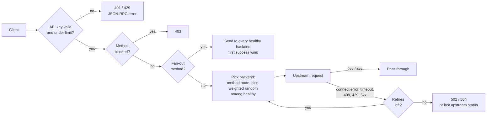

# sol-rpc-router

[](https://github.com/roborun-xyz/sol-rpc-router/actions/workflows/ci.yml)
[](LICENSE)

One URL in front of all your Solana RPC providers. Written in Rust, built for bots.

You have a Helius key, a Triton key, a QuickNode key and the public RPC. Your bots have one hard-coded URL. When a provider rate-limits you, lags behind the tip, or just dies, you want traffic to move somewhere else *before* you notice. You also want to hand a key to a friend without handing them your provider credentials or an unlimited bill.

`sol-rpc-router` is that layer:

- **Automatic failover.** Connection errors, timeouts, 429s and 5xxs are retried on a different healthy backend. Clients see one response.
- **Latency-aware routing (opt-in).** `selection = "latency_weighted"` scales each backend's weight by how its observed request latency compares to the fastest one, so slow providers quietly get less traffic without being cut off.
- **Provider budgets.** Give each backend a `max_rps` and the router stops sending to it before the provider starts refusing. A free public endpoint can sit next to a paid plan without ever tripping its limit.
- **`sendTransaction` fan-out.** Broadcast a transaction to every healthy backend at once and return the first success, so the transaction reaches every provider you have, not just the one the dice picked.
- **Consensus-aware health checks.** A backend that falls more than N slots behind the best one is pulled from rotation until it catches up.
- **Per-key auth and rate limits.** Give each bot, friend or service its own key, RPS budget and expiry. Keys live in your config file (zero dependencies) or in Redis when you run several routers that must share limits.
- **Method blocklist and routing.** Keep `getProgramAccounts` off the shared endpoint, or pin DAS calls to the one provider that supports them.
- **WebSockets too.** Subscriptions go through the same auth and backend selection.
- **Observability built in.** Prometheus metrics, a Grafana dashboard, a `/health` endpoint with per-backend slot and latency, `x-request-id` on every response and `x-rpc-backend` on every proxied one.
- **Fast.** About 79k req/s in-process at p99 1.8 ms on an Apple M3 Pro laptop, full middleware stack included (see [Benchmark](#benchmark)). The router will not be your bottleneck.

## Quick start

### Docker Compose (router + Redis + Prometheus + Grafana)

```bash
git clone https://github.com/roborun-xyz/sol-rpc-router && cd sol-rpc-router
cp config.example.toml config.toml        # put your provider URLs in here
docker compose up -d --build
docker compose exec router rpc-admin create my-bot --rate-limit 100
```

Point your bot at `http://localhost:28899/?api-key=<the key it printed>`. Grafana is on <http://localhost:3000> (admin / admin) with the dashboard pre-provisioned.

### Single binary, no Redis

Put keys straight in the config and leave `redis_url` empty:

```toml
[[api_keys]]
key = "a-long-random-string"
owner = "my-bot"
rate_limit = 100
```

```bash
cargo build --release
./target/release/sol-rpc-router --config config.toml
```

Edit the key list and send `SIGHUP` to apply it without a restart. Rate limits are enforced in-process, so this mode is for one router instance.

Tagged releases publish pre-built binaries (Linux and macOS, x86_64 and arm64) and a multi-arch container image at `ghcr.io/roborun-xyz/sol-rpc-router`; see the [releases page](https://github.com/roborun-xyz/sol-rpc-router/releases).

## Using it

Any Solana client works unchanged. Pass the key as a query parameter, a header, or a bearer token:

```bash
# query parameter (works with every SDK, just change the URL)
curl -X POST 'http://localhost:28899/?api-key=KEY' -H 'content-type: application/json' \
  -d '{"jsonrpc":"2.0","id":1,"method":"getSlot"}'

# header
curl -X POST http://localhost:28899/ -H 'x-api-key: KEY' -H 'content-type: application/json' \
  -d '{"jsonrpc":"2.0","id":1,"method":"getLatestBlockhash"}'

# bearer
curl -X POST http://localhost:28899/ -H 'authorization: Bearer KEY' ...
```

```ts
import { Connection } from "@solana/web3.js";

const connection = new Connection("http://localhost:28899/?api-key=KEY", {
  wsEndpoint: "ws://localhost:28900/?api-key=KEY",   // or ws://localhost:28899/?api-key=KEY
  commitment: "confirmed",
});
```

Every proxied response carries:

| Header | Meaning |
|---|---|
| `x-rpc-backend` | Label of the backend that answered |
| `x-rpc-attempts` | How many backends were tried (normal) or how many had replied when the winner was picked (fan-out) |
| `x-request-id` | Generated per request, or echoed if you sent one. Also forwarded upstream. |

Router credentials (`?api-key=`, `x-api-key`, `authorization`) are stripped before the request is forwarded, and upstream `set-cookie` headers are dropped on the way back. Backend URLs may carry their own `?api-key=` for the provider; the router merges them correctly and never prints the query string in logs or errors.

## How a request flows



### Failover rules

| Upstream outcome | Action |
|---|---|
| 2xx, or 4xx other than 408/429 | Returned to the client as-is |
| 408, 429, 5xx | Retried on another healthy backend; if retries run out, the last upstream response is returned untouched |
| Connection error or timeout | Retried on another healthy backend; if retries run out, a 502 / 504 JSON-RPC error is returned |

`proxy.max_retries` (default `2`) caps the extra backends tried. A backend is never tried twice for one request. Method routes are honoured on the first attempt only.

### Selection strategies

When no method route applies, a backend is picked at random among healthy backends with budget, in proportion to a weight:

- `weighted` (default): the configured `weight`.
- `latency_weighted`: `weight × (fastest_latency / own_latency)`, using an exponentially weighted moving average of real request latency through each backend (not probe latency). The fastest backend keeps its full weight; one twice as slow gets half; nothing drops below 5 % of its weight, so a slow provider keeps getting a trickle and can recover. Backends with no sample yet count as fastest so they get measured. `/health` shows the EWMA as `request_latency_ms`.

### Provider budgets

A backend with `max_rps = N` gets a token bucket of N requests per second (one-second burst). Selection only considers healthy backends with a token left, so traffic shifts to the others before the metered provider sees a 429; its weight still applies among backends that have budget. Fan-out skips budget-less backends too. If every healthy backend is out of budget the client gets a 429 with `Retry-After: 1` rather than a request that would fail upstream. Budgets are per router instance.

### Fan-out

For methods listed in `proxy.fanout_methods` (typically `["sendTransaction"]`), the request is sent to every healthy backend concurrently. The first response that is HTTP 2xx *and* has no JSON-RPC `error` member is returned. If nobody succeeds, the first upstream error body (e.g. `Blockhash not found`) is surfaced so you can act on it. The other sends are not cancelled when a winner is picked, so every backend still gets the transaction.

Fan-out multiplies your upstream request count by the number of healthy backends. It is opt-in. With only one healthy backend the call is sent normally (no fan-out, no `rpc_fanout_total` sample). Fan-out requests are sent without `accept-encoding` so the router can inspect the replies.

### Health checks

Every `interval_secs`, all backends are probed concurrently with `health_check.method` (`getSlot` by default). A backend fails a probe when the request errors, times out, returns a non-2xx status, or, for `getSlot` / `getBlockHeight`, is more than `max_slot_lag` slots behind the best backend in the same round. `consecutive_failures_threshold` probes in a row remove it from rotation; `consecutive_successes_threshold` put it back. Backends start healthy, so a fresh router serves traffic immediately.

## Configuration

```toml
port = 28899             # JSON-RPC over HTTP + WebSocket upgrades. Dedicated WS listener on port+1.
metrics_port = 28901     # Prometheus. Keep it private.
redis_url = "redis://127.0.0.1:6379/0"   # or set REDIS_URL

[[backends]]
label = "helius"
url = "https://mainnet.helius-rpc.com/?api-key=YOUR_KEY"
ws_url = "wss://mainnet.helius-rpc.com/?api-key=YOUR_KEY"   # optional; needed for WebSocket traffic
weight = 10

[[backends]]
label = "public"
url = "https://api.mainnet-beta.solana.com"
weight = 1
max_rps = 8                            # optional upstream budget (req/s); 0 or absent = unlimited

[proxy]
timeout_secs = 30                      # per attempt
max_retries = 2                        # extra backends to try on failure
fanout_methods = ["sendTransaction"]
blocked_methods = ["getProgramAccounts"]
shutdown_grace_secs = 10               # drain time after SIGTERM
max_ws_connections_per_key = 100       # concurrent WebSocket sessions per key, 0 = unlimited
selection = "weighted"                 # or "latency_weighted" (see Selection strategies)

[health_check]
interval_secs = 30
timeout_secs = 5
method = "getSlot"
consecutive_failures_threshold = 3
consecutive_successes_threshold = 2
max_slot_lag = 50

[method_routes]                        # pin methods to a backend; falls back if it is unhealthy
getAsset = "helius"
searchAssets = "helius"
```

See [`config.example.toml`](config.example.toml) for the annotated version. Validation rejects unknown fields, empty or duplicate labels, zero weights, zero timeouts or thresholds, non-`http(s)` / `ws(s)` URLs, routes to unknown labels, port collisions, methods that are both fanned out and blocked, and ambiguous keystore settings.

### Hot reload

Edit the file, then send `SIGHUP` (`./reload.sh`, or `docker compose kill -s HUP router`). Backends, weights, routes, fan-out and blocked lists, proxy timeouts, health-check settings and `[[api_keys]]` are swapped atomically; in-flight requests finish on the old state. Backends that keep their label keep their health history. `port`, `metrics_port`, `redis_url` and `shutdown_grace_secs` need a restart; the router logs a warning if they changed in the file. Unknown keys anywhere in the file are rejected at load time, so typos cannot silently disable a setting.

### Environment

| Variable | Effect |
|---|---|
| `RPC_ROUTER_CONFIG` | Config path (same as `--config`) |
| `REDIS_URL` | Overrides `redis_url` from the file (selects the Redis keystore) |
| `RUST_LOG` | Log level, e.g. `info` or `sol_rpc_router=debug` |

## API keys

Two keystores; the config picks one.

**Config file** (`redis_url` empty, `[[api_keys]]` present): each entry has `key`, `owner`, optional `rate_limit` (req/s, `0` = unlimited), `expires_at` (unix seconds, `0` = never) and `active`. Changes apply on `SIGHUP`. Limits are per-second windows kept in memory, so they are per router instance. No `rpc-admin` needed.

**Redis** (`redis_url` set): keys are hashes (`api_key:<key>`) with `owner`, `rate_limit`, `active`, `created_at` and optional `expires_at`, managed with `rpc-admin`. The router caches lookups for 60 s, so revocations and limit changes take up to a minute to apply. Rate limits are per-second counters enforced atomically in Redis, so they hold across multiple router instances sharing one Redis.

```bash
rpc-admin create alice --rate-limit 50                 # 50 req/s, never expires
rpc-admin create trial --rate-limit 10 --expires-in 7d # relative expiry (s, m, h, d, w); or --expires-at <unix>
rpc-admin create ci --rate-limit 0 --key my-fixed-key  # 0 = unlimited; custom key value
rpc-admin list [--owner alice]
rpc-admin inspect <key>                                 # includes requests used this second
rpc-admin update <key> --rate-limit 100 --owner bob --active false --expires-in 30d   # or --expires-at <unix>, 0 clears
rpc-admin revoke <key>                                  # keeps metadata, stops working
rpc-admin delete <key>                                  # gone
```

`--redis-url` or `REDIS_URL` selects the Redis instance.

## Endpoints

| Endpoint | Method | Auth | Description |
|---|---|---|---|
| `/` | POST | yes | JSON-RPC proxy (single or batch) |
| `/*path` | POST | yes | Same, with the sub-path appended to the backend URL |
| `/` | GET + `Upgrade: websocket` | yes | WebSocket proxy on the main port |
| `ws://host:port+1/` | WS | yes | Dedicated WebSocket listener |
| `/health` | GET | no | Backend status JSON; 200 if any backend is healthy, else 503 |
| `:metrics_port/metrics` | GET | no | Prometheus metrics |

Router-generated errors are JSON-RPC shaped and keep your request `id` when the body has been parsed (authentication happens before the body is read, so 401/429/500 carry `id: null`). Router codes live in `-32090..-32099`, outside the `-32001..-32016` range Solana nodes use for their own errors, so clients never mistake a router condition for a node condition:

```json
{"jsonrpc":"2.0","error":{"code":-32091,"message":"Rate limit exceeded"},"id":null}
```

| HTTP | code | When |
|---|---|---|
| 401 | -32090 | Missing, unknown, revoked, expired or over-long key |
| 429 | -32091 | Key over its per-second limit (`Retry-After: 1`), or over `max_ws_connections_per_key` |
| 403 | -32092 | Method is in `blocked_methods` |
| 503 | -32093 | No healthy backend |
| 502 | -32094 | All attempts failed with transport errors |
| 504 | -32095 | All attempts timed out |
| 429 | -32096 | Every healthy backend is out of `max_rps` budget (`Retry-After: 1`) |
| 408 / 413 | -32600 | Body took over 10 s to arrive / exceeds 10 MB |
| 500 | -32603 | Keystore failure (for example Redis down) |

Upstream responses, including upstream JSON-RPC errors, pass through unchanged.

## Observability

`GET /health`:

```json
{
  "overall_status": "healthy",
  "version": "0.3.0",
  "healthy_backends": 2,
  "total_backends": 3,
  "backends": [
    { "label": "helius", "healthy": true, "slot": 454772124, "latency_ms": 43,
      "request_latency_ms": 38.5, "has_capacity": true,
      "last_check_unix": 1791523681, "last_check_age_secs": 1,
      "consecutive_failures": 0, "consecutive_successes": 2, "last_error": null },
    { "label": "dead", "healthy": false, "slot": null, "latency_ms": 0,
      "request_latency_ms": null, "has_capacity": true,
      "last_check_unix": 1791523681, "last_check_age_secs": 1,
      "consecutive_failures": 3, "consecutive_successes": 0,
      "last_error": "Health check request failed: client error (Connect)" }
  ]
}
```

Prometheus metrics (the `rpc_method` label is restricted to known Solana methods plus `batch` and `other`, so clients cannot inflate cardinality):

| Metric | Type | Labels |
|---|---|---|
| `rpc_requests_total` | counter | `method`, `status`, `rpc_method`, `backend`, `owner` |
| `rpc_request_duration_seconds` | histogram | `rpc_method`, `backend`, `owner` |
| `rpc_upstream_attempts_total` | counter | `backend`, `outcome` (`ok`, `upstream_status`, `retryable_status`, `timeout`, `transport_error`) |
| `rpc_failovers_total` | counter | `rpc_method` |
| `rpc_fanout_total` | counter | `rpc_method`, `outcome` (`ok`, `failed`) |
| `rpc_blocked_total` | counter | `rpc_method`, `owner` |
| `rpc_backends_at_capacity_total` | counter | `rpc_method` |
| `rpc_backend_health` | gauge | `backend` (1 healthy, 0 not) |
| `rpc_backend_slot` | gauge | `backend` |
| `rpc_backend_slot_lag` | gauge | `backend` (slots behind the best backend) |
| `rpc_backend_health_check_duration_seconds` | histogram | `backend` |
| `rpc_backend_request_latency_ewma_seconds` | gauge | `backend` |
| `ws_connections_total` | counter | `backend`, `owner`, `status` |
| `ws_active_connections` | gauge | `backend`, `owner` |
| `ws_messages_total` | counter | `backend`, `owner`, `direction` |
| `ws_connection_duration_seconds` | histogram | `backend`, `owner` |

The Grafana dashboard in [`grafana/dashboards`](grafana/dashboards) covers throughput, latency, per-backend health and slot lag, failovers, fan-out outcomes, error rates and per-owner usage. `docker compose up` provisions it automatically.

Request logs are one line per request with method, status, duration, backend, owner, attempt count and request id.

## Deployment notes

- The router speaks plain HTTP. Terminate TLS in front of it (Caddy, nginx, a cloud load balancer).
- The container `HEALTHCHECK` probes port 28899; override it if you change `port`. `/health` requests are excluded from request logs and metrics.
- Expose `port` (and `port+1` if you want the dedicated WS listener). Keep `metrics_port` and Redis private.
- Run as many router instances as you like against one Redis; rate limits stay consistent. With the file keystore each instance limits independently.
- Authentication runs before the request body is read, bodies are capped at 10 MB with a 10 s read timeout, key lookups are cached in a bounded cache, and WebSocket sessions are capped per key.
- `SIGTERM` stops accepting connections, drains in-flight requests for `shutdown_grace_secs`, then exits. Long-lived WebSocket sessions are cut at the deadline.
- CPU needs are small: with the benchmark process pinned to one tokio worker thread (router, mock upstream and load generator all sharing it) it still does about 28k req/s.

## Benchmark

`cargo run --release --bin sol-rpc-router-bench -- -c 64 -d 10` starts a mock upstream and the router (the same router assembly the binary uses, middleware included) in one process and floods it, so the number is the router's own overhead with no network or Redis in the loop.

```
Concurrency:     64
Total Requests:  792166   (10 s)
RPS:             79216
P50 Latency:     0.77ms
P99 Latency:     1.82ms
P99.9 Latency:   4.39ms
```

Apple M3 Pro (11 cores), release profile with LTO, measured 2026-10-08. Same run with `TOKIO_WORKER_THREADS=1`: 28k req/s, p99 3.2 ms.

## Development

```bash
cargo test                      # unit + integration tests, no external services needed
cargo clippy --all-targets      # CI runs this with -D warnings
cargo fmt

# keystore test against a real Redis
docker run -d -p 6379:6379 redis:7-alpine
TEST_REDIS_URL=redis://127.0.0.1:6379/15 cargo test --test redis_keystore_test
```

```
src/
  main.rs        startup, signal handling, graceful shutdown
  config.rs      TOML config + validation
  state.rs       RouterState (ArcSwap for hot reload), backend selection
  handlers.rs    middleware, HTTP proxy (retry + fan-out), /health, WebSocket proxy
  upstream.rs    upstream URI/header construction, retry classification
  rpc.rs         JSON-RPC probing, error bodies, known-method list
  health.rs      health check loop with slot-lag consensus
  keystore.rs    KeyStore trait, FileKeyStore (config keys, in-memory limits), RedisKeyStore
  router.rs      router assembly shared by the binary, benchmark and tests
  mock.rs        in-memory KeyStore for tests
  bin/           rpc-admin, sol-rpc-router-bench
tests/           integration tests (mock backends bind to 127.0.0.1:0)
```

## License

Apache-2.0
